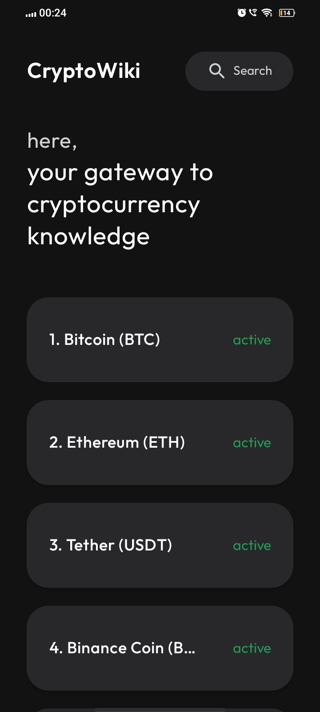
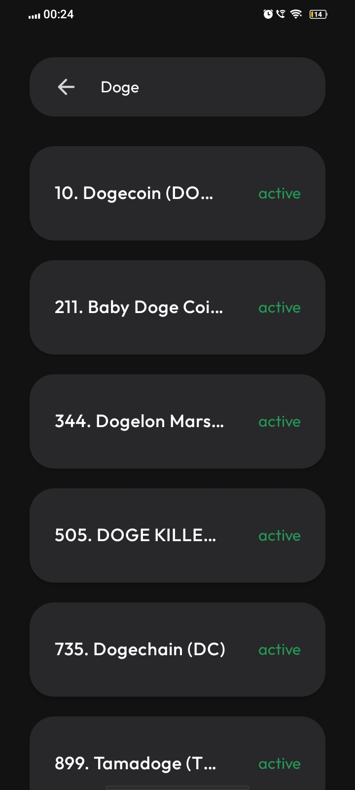
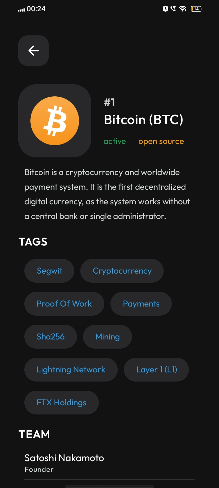

# CryptoWiki


CryptoWiki is a comprehensive Android application developed using Jetpack Compose, aimed at providing users with up-to-date information and resources on cryptocurrencies.

[](https://play.google.com/store/apps/details?id=in.hypernation.cryptowiki)

## Overview

CryptoWiki serves as a user-friendly guide for both beginners and seasoned crypto enthusiasts. It offers a wide range of features including:

- Real-time cryptocurrency data.
- Detailed information on thousands of cryptocurrencies.
- News updates and trends in the crypto world.
- Clean and intuitive user interface designed with Jetpack Compose.

## Tech Stack

- **Retrofit:** For making API requests and fetching real-time cryptocurrency data.
- **Hilt Dagger:** For dependency injection, enabling a more modular and scalable codebase.
- **MVVM Architecture:** Follows the Model-View-ViewModel architectural pattern for better separation of concerns and maintainability.

## Features

- **Real-time Data:** Stay updated with real-time cryptocurrency prices and market trends.
- **Comprehensive Information:** Access detailed information on thousands of cryptocurrencies, including market capitalization, trading volume, and more.
- **News Updates:** Stay informed with the latest news and trends in the crypto space.
- **User-Friendly Design:** Enjoy a clean and intuitive user interface designed with Jetpack Compose, making navigation effortless.

## Getting Started

To get started with CryptoWiki, follow these steps:

1. Clone the repository:

   ```bash
   git clone https://github.com/harshrajput1506/cryptowiki.git


2. Open the project in Android Studio.

3. Build and run the project on an Android emulator or a physical device.

## Screenshots

| Screenshot 1 | Screenshot 2 | Screenshot 3 |
|--------------|--------------|--------------|
|  |  |  |

## Contributing

Contributions to CryptoWiki are welcome! If you find any bugs, have feature requests, or want to contribute enhancements, please feel free to open an issue or submit a pull request.

Before contributing, please review the [Contribution Guidelines](CONTRIBUTING.md).

## Feedback

Your feedback is important to us! If you have any suggestions, questions, or concerns, please don't hesitate to reach out to us.

## License

CryptoWiki is licensed under the [MIT License](LICENSE).
